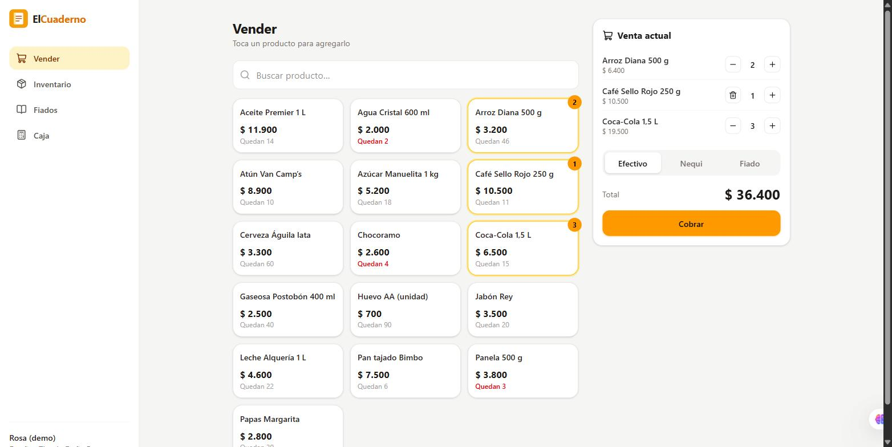
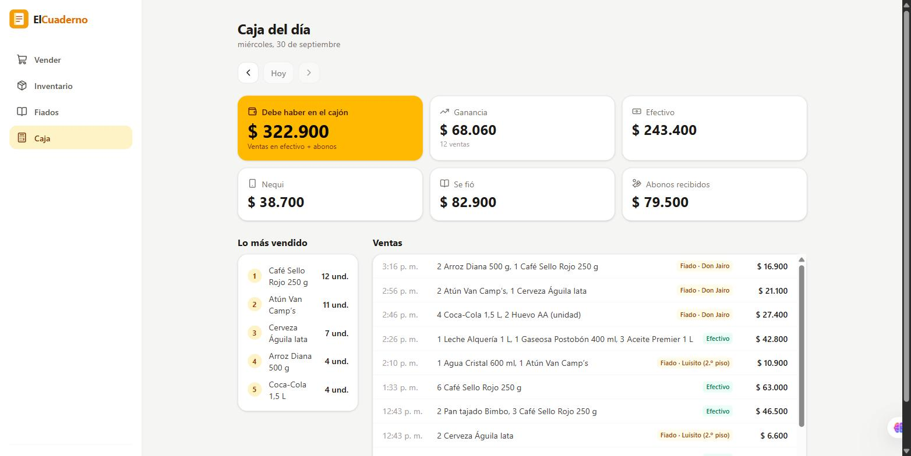
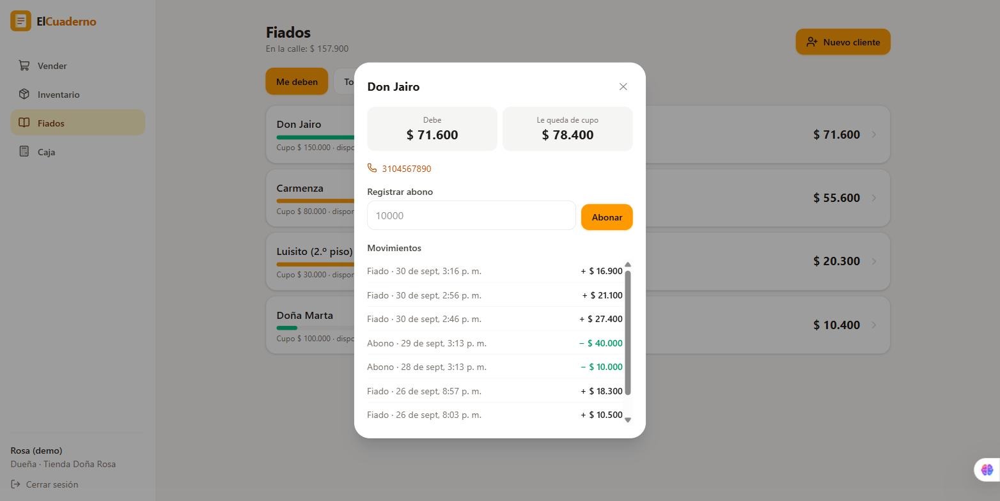
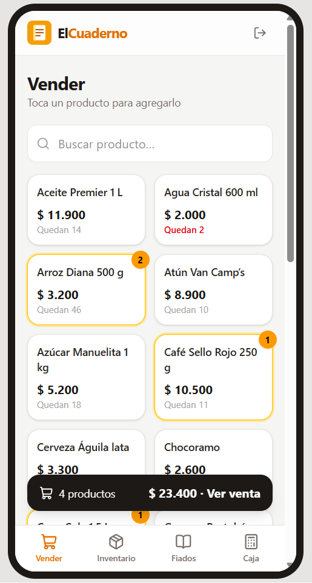

# ElCuaderno


> *El cuaderno de la tienda, ahora en el celular.*

En la tienda de barrio se vende fiado y se anota en un cuaderno. Ahí se pierden las cuentas: no se sabe cuánto debe cada vecino, qué se está acabando ni cuánto se ganó en el día. **ElCuaderno** registra ventas en efectivo, Nequi o fiado, descuenta el inventario solo, controla el cupo de fiado de cada cliente y cierra la caja del día con la ganancia real.

**Demo en vivo:** [elcuaderno-demo.vercel.app](https://elcuaderno-demo.vercel.app). Entra con un clic como **dueña** o como **cajero** de la "Tienda Doña Rosa", que tiene una semana de ventas de ejemplo. La API está en un plan gratuito: si nadie la ha usado en un rato, la primera carga tarda cerca de un minuto.



| Caja del día | Fiados de un cliente | En el celular |
|---|---|---|
|  |  |  |

El diseño completo (historias de usuario, reglas de negocio y modelo de datos) está en [`docs/01-diseno.md`](docs/01-diseno.md).

## Lo más interesante técnicamente

- **TypeScript de punta a punta con validación compartida.** Los esquemas Zod viven en [`packages/shared`](packages/shared/src/index.ts). El mismo esquema valida el formulario en React (el error aparece antes de enviar) y el cuerpo de la petición en NestJS (con un [`ZodPipe`](apps/api/src/comun/zod.pipe.ts)). Una regla se escribe una sola vez.
- **Sin sobreventa aunque dos cajeros vendan al mismo tiempo.** La venta descuenta el stock con `UPDATE ... WHERE stock >= cantidad` dentro de una transacción ([`ventas.service.ts`](apps/api/src/ventas/ventas.service.ts)). Si un producto no alcanza, la venta completa se cancela. Una prueba lanza 5 ventas simultáneas de la última unidad y verifica que solo una gana.
- **El cupo de fiado no se puede pasar.** Antes de fiar se bloquea la fila del cliente (`SELECT ... FOR UPDATE`), así dos fiados o dos abonos al mismo tiempo no se saltan la validación. Otra prueba lo comprueba.
- **La deuda no se guarda: se calcula** (fiados − abonos) con subconsultas en SQL, así nunca queda desincronizada.
- **Dinero en pesos enteros** (`integer`), nunca `float`; el detalle de cada venta guarda el precio y el costo del momento, y "hoy" se calcula en hora de Colombia.
- **Roles.** La dueña maneja precios, cupos y la caja; el cajero vende y recibe abonos. Una guarda global de NestJS exige el token en todas las rutas y revisa el rol con `@Roles('DUENO')`.

## Stack

| Capa | Tecnologías |
|---|---|
| Lenguaje | TypeScript en todo el monorepo (npm workspaces) |
| API | NestJS 11, Drizzle ORM, PostgreSQL 16, JWT, bcrypt |
| Validación | Zod, compartido entre frontend y backend |
| Frontend | React 19, Vite, Tailwind CSS 4, TanStack Query, React Router |
| Pruebas | Jest + Supertest contra PostgreSQL real (27 pruebas) |
| Infraestructura | Docker Compose, GitHub Actions, Render, Neon, Vercel |

```
ElCuaderno/
├── packages/shared/   esquemas Zod, tipos y formato de pesos
├── apps/api/          NestJS: auth, productos, clientes, ventas, caja (+ migraciones y demo)
├── apps/web/          React: vender, inventario, fiados, caja
└── docs/              diseño y capturas
```

## API

Todas las rutas van bajo `/api` y exigen `Authorization: Bearer <token>`, salvo login y salud.

| Método | Ruta | Rol | Descripción |
|---|---|---|---|
| POST | `/auth/login` | Público | Inicia sesión y devuelve el token |
| GET | `/productos?q=&bajoStock=true` | Todos | Productos con alerta de stock bajo |
| POST / PUT / DELETE | `/productos`, `/productos/:id` | Dueña | Crear, editar, desactivar |
| PATCH | `/productos/:id/entrada` | Dueña | Suma mercancía que llegó |
| GET | `/clientes?deudores=true`, `/clientes/:id` | Todos | Clientes con deuda, cupo disponible e historial |
| POST / PUT | `/clientes`, `/clientes/:id` | Dueña | Crear clientes y definir su cupo |
| POST | `/clientes/:id/abonos` | Todos | Registrar un abono |
| POST | `/ventas` | Todos | Venta en efectivo, Nequi o fiado |
| GET | `/ventas?dia=AAAA-MM-DD` | Todos | Ventas de un día |
| GET | `/caja/resumen?dia=AAAA-MM-DD` | Dueña | Cierre de caja: medios, abonos, ganancia, más vendidos |

## Cómo correrlo en local

Requisitos: Node.js 22+ y Docker.

```bash
docker compose up -d                 # PostgreSQL en el puerto 5434
npm install
npm run build:shared
npm run build -w @elcuaderno/api
npm run db:migrate -w @elcuaderno/api
npm run demo -w @elcuaderno/api      # Tienda Doña Rosa: rosa@elcuaderno.co / Demo2026!
npm run start -w @elcuaderno/api     # API en http://localhost:3100/api
npm run dev:web                      # http://localhost:5174
```

## Pruebas

```bash
docker exec elcuaderno_db psql -U elcuaderno -c "CREATE DATABASE elcuaderno_test"   # solo la primera vez
npm test
```

Levantan la aplicación completa y hablan con un PostgreSQL real: autenticación y roles, validaciones compartidas, ventas atómicas, concurrencia sobre la última unidad, cupo de fiado, abonos simultáneos, aislamiento entre tiendas y el cierre de caja en hora de Colombia.

## Despliegue

| Capa | Servicio | Configuración |
|---|---|---|
| Frontend | Vercel | Carpeta `apps/web`; instala desde la raíz del monorepo ([`vercel.json`](apps/web/vercel.json)) |
| API | Render (Ohio) | Definida en [`render.yaml`](render.yaml); al arrancar migra y recarga la demo |
| Base de datos | Neon, PostgreSQL 16 | El enlace solo vive en las variables de Render |

---

Proyecto de portafolio de **Manuela Córdoba Robledo**, aprendiz de Análisis y Desarrollo de Software (SENA). · [Portafolio](https://manuela-cordoba.vercel.app) · [LinkedIn](https://www.linkedin.com/in/manuela-cordoba-dev/)
