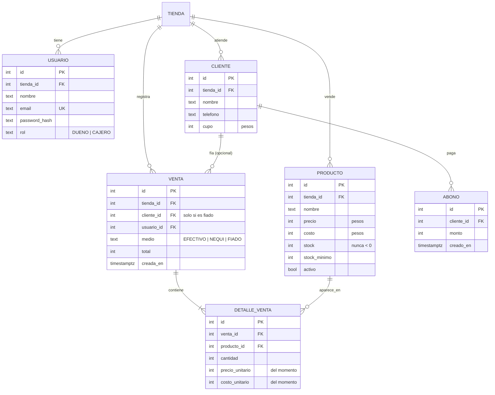

# ElCuaderno: documento de diseño

> *El cuaderno de la tienda, ahora en el celular.*

## 1. El problema

En Colombia, la tienda de barrio vende a crédito ("fiado") a los vecinos y lo anota en un cuaderno. Ahí también se pierden las cuentas: no se sabe cuánto debe cada cliente, qué productos se están acabando ni cuánto se ganó en el día. Los programas de punto de venta que existen son caros o pensados para supermercados.

**ElCuaderno** reemplaza ese cuaderno: registra ventas en efectivo, Nequi o fiado, lleva el inventario solo, controla el cupo de fiado de cada vecino y cierra la caja del día con la ganancia real.

## 2. Alcance (versión 1)

**Incluye:**
- Inicio de sesión con dos roles: **dueño** y **cajero**.
- Productos con precio de venta, costo, stock y stock mínimo, con alerta cuando se están acabando.
- Clientes (vecinos) con un **cupo de fiado**.
- Ventas rápidas desde el celular: carrito, forma de pago (efectivo, Nequi o fiado) y descuento automático del inventario.
- Abonos a la deuda de un cliente.
- Caja del día: cuánto entró por cada medio, cuánto se fió, cuánto se abonó y la ganancia.
- Reportes: productos más vendidos y lista de deudores.

**No incluye (a propósito):** facturación electrónica, varias tiendas ni pagos en línea.

## 3. Historias de usuario

| ID | Como… | Quiero… | Para… |
|---|---|---|---|
| HU-01 | dueño | registrar mis productos con precio, costo y stock | saber qué tengo y cuánto gano |
| HU-02 | cajero | vender varios productos en una sola venta desde el celular | atender rápido en el mostrador |
| HU-03 | cajero | vender fiado a un vecino | reemplazar el cuaderno |
| HU-04 | cajero | registrar un abono | que la deuda baje sin hacer cuentas a mano |
| HU-05 | dueño | ver qué productos se están acabando | pedirle al proveedor a tiempo |
| HU-06 | dueño | ver quién me debe y cuánto | cobrar sin pena y sin olvidos |
| HU-07 | dueño | cerrar la caja del día | saber cuánto debe haber en el cajón y en Nequi |
| HU-08 | dueño | ponerle un cupo de fiado a cada vecino | no fiar más de lo que puedo |

## 4. Reglas de negocio

| ID | Regla | Por qué |
|---|---|---|
| RN-01 | El dinero se guarda como **pesos enteros** (`integer`), nunca como decimal flotante | En Colombia los precios no usan centavos y con `float` aparecen errores de redondeo |
| RN-02 | El stock **nunca queda negativo**. La venta descuenta con un `UPDATE ... WHERE stock >= cantidad` dentro de una transacción | Dos cajeros vendiendo el último producto al mismo tiempo no pueden venderlo dos veces |
| RN-03 | Una venta se guarda completa o no se guarda (transacción) | Si falla un producto, no puede quedar la mitad descontada |
| RN-04 | Cada detalle de venta guarda el **precio y el costo del momento** | Si mañana sube el precio, las ventas de ayer no cambian |
| RN-05 | Un fiado no puede superar el **cupo** del cliente | El dueño decide cuánto arriesga con cada vecino |
| RN-06 | Un abono no puede ser mayor que la deuda | No se puede deber negativo |
| RN-07 | La deuda **no se guarda**: se calcula como fiados − abonos | Nunca queda desincronizada |
| RN-08 | Solo el **dueño** crea o cambia productos, precios y cupos. El cajero vende y registra abonos | Control de quién toca el dinero |
| RN-09 | "Hoy" se calcula en **hora de Colombia** (America/Bogota) | Una venta a las 9 p. m. no puede caer en el día siguiente |
| RN-10 | Los productos con ventas no se borran: se **desactivan** | El historial se conserva |

## 5. Modelo de datos



Cada tabla lleva `tienda_id` para que la base ya esté lista para varias tiendas, aunque la versión 1 tenga una sola.

## 6. Arquitectura

| Capa | Tecnología | Por qué |
|---|---|---|
| Lenguaje | TypeScript en todo el proyecto | Los mismos tipos en el frontend y en el backend |
| Validación compartida | Zod en `packages/shared` | Un solo esquema valida el formulario en React y el cuerpo de la petición en la API |
| API | NestJS 11 | Módulos, inyección de dependencias y guardas de roles: el estándar para Node.js en empresas |
| Datos | Drizzle ORM + PostgreSQL 16 | Consultas tipadas y SQL explícito donde importa (el descuento de stock) |
| Autenticación | JWT + bcrypt | Sesión sin estado, con rol dentro del token |
| Frontend | React 19 + Vite + Tailwind + TanStack Query | Pensado primero para el celular del mostrador |
| Pruebas | Jest + Supertest contra PostgreSQL real | Incluye una prueba de concurrencia sobre el último producto |
| Infraestructura | Docker, GitHub Actions, Render, Neon, Vercel | El mismo flujo de los otros proyectos |

```
ElCuaderno/
├── packages/shared/   esquemas Zod, tipos y utilidades de dinero
├── apps/api/          NestJS: auth, productos, clientes, ventas, abonos, caja
└── apps/web/          React: vender, inventario, fiados, caja
```
